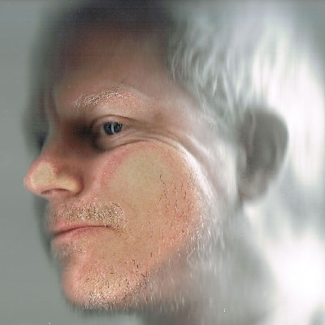

Originally from New Jersey, Kevin now lives and works in Miramar, Wellington.  His creative practice has recently been centered around content creation for head mounted displays and VR; developing expertise in 360 Stereoscopic video production, motion capture virtual production, and interactive content generation using game engines.  He is currently a supervisor at Weta Digital with 17 years experience producing computer generated visual effects for feature films.  His credits include King Kong (2005), Avatar (2009), Avengers (2012), The Hobbit series, and many others.  Kevin is a part time lecturer at Victoria University of Wellington’s School of Media Design. He has a BFA from the School of Visual Arts in New York City.

